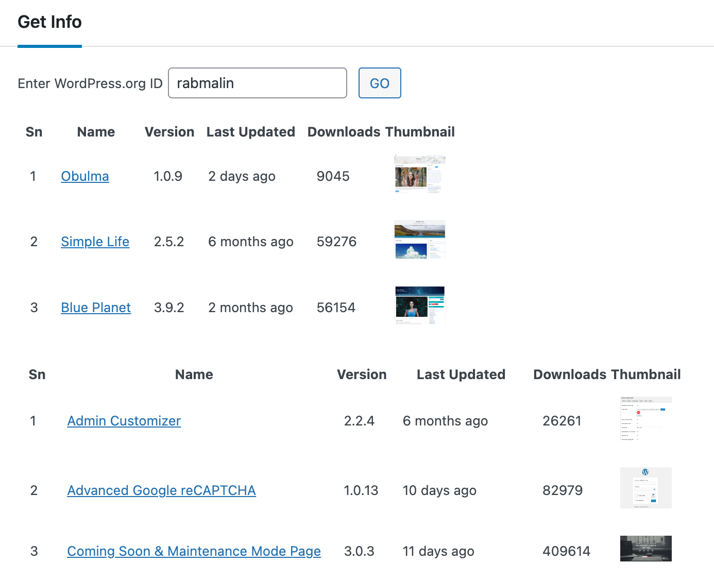

# Directory Info

Simple plugin to list your themes and plugins in the directory.

## Usage

* [Download plugin](https://github.com/ernilambar/directory-info/releases/latest/download/directory-info.zip)
* Navigate to the `Add New` Plugin Dashboard
* Select the downloaded zip file from your computer
* Upload
* Activate the plugin on the WordPress Plugin Dashboard
* Go to `Tools` -> `Directory Info`
* Enter WordPress.org ID
* Click `GO`

## Example

